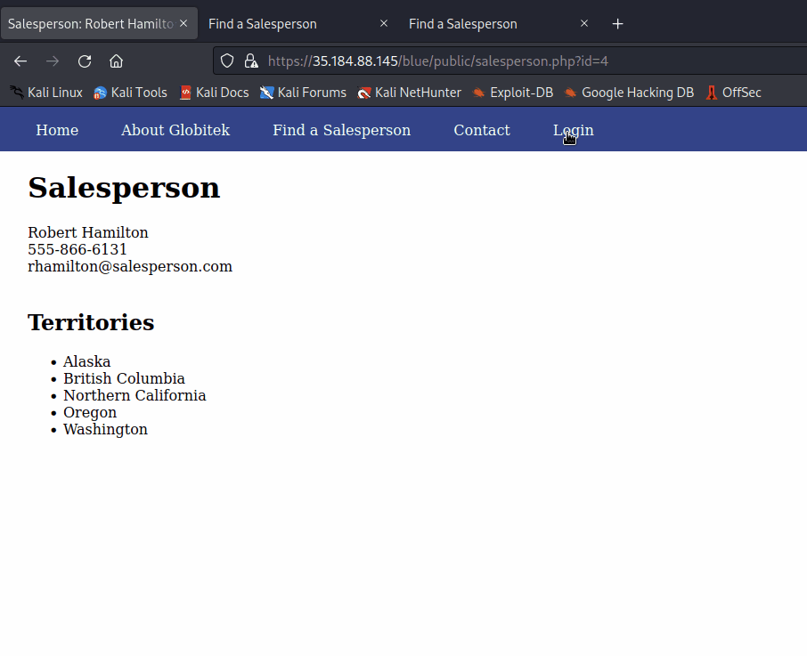
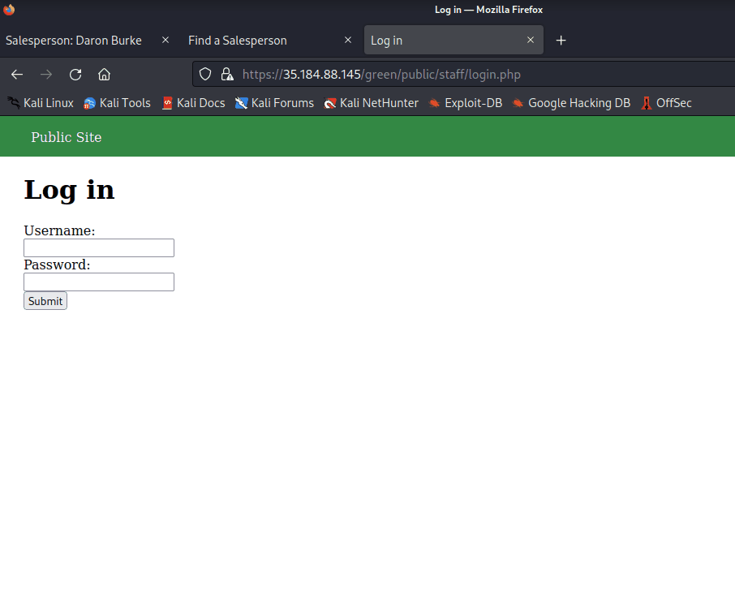
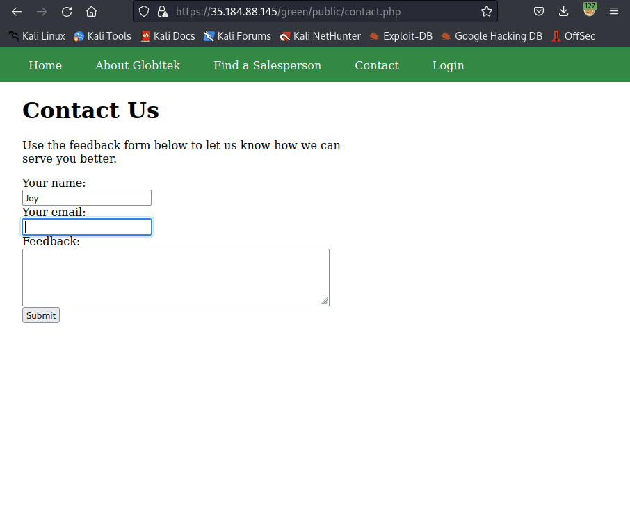
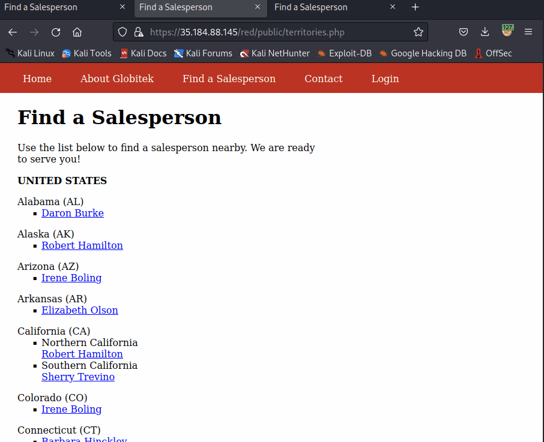
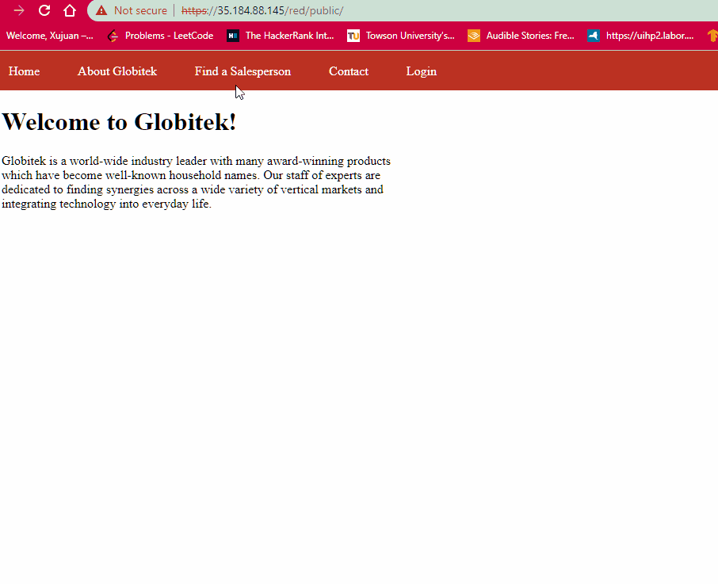

# Pen Testing Live Targets

Time spent: **8** hours spent in total

> Objective: Identify vulnerabilities in three different versions of the Globitek website: blue, green, and red.

The six possible exploits are:

* Username Enumeration
* Insecure Direct Object Reference (IDOR)
* SQL Injection (SQLi)
* Cross-Site Scripting (XSS)
* Cross-Site Request Forgery (CSRF)
* Session Hijacking/Fixation

Each color is vulnerable to only 2 of the 6 possible exploits. First discover which color has the specific vulnerability, then write a short description of how to exploit it, and finally demonstrate it using screenshots compiled into a GIF.

## Blue

Vulnerability #1: SQL Injection (SQLi)

Description:
  - A vulnerability of SQL Injection by query. 
  - code: ```https://35.184.88.145/blue/public/salesperson.php?id=4'OR SLEEP(3)=0--' ```
  


Vulnerability #2: Session Hijacking/Fixation

Description:
  - A vulnerability of Session Hijacking/Fixation. 
  - code: ```https://35.184.88.145/blue/public/hacktools/change_session_id.php ```
  - Change the session id to the one we hijacked by sniffing the network, we are able to bypass user login.
  


## Green

Vulnerability #1: Username Enumeration

Description:
  - A vulnerability of Username Enumeration. 
  - When the username is valid and the password is incorrect, the error was bold. Otherwise the error was not bold.
  


Vulnerability #2: Cross-Site Scripting (XSS)

Description:
  - A vulnerability of Cross-Site Scripting (XSS). 
  - code: ```<script>alert('XXX found the XSS!');</script> ```
  - Post the malicious script code through Contact Form. The XSS attack was succeed on green site and pop-up on the feedback page.
  


## Red

Vulnerability #1: Insecure Direct Object Reference (IDOR)

Description:
  - A vulnerability of Insecure Direct Object Reference (IDOR). 
  - We are able to see sensitive information by change the query id. The id of 10, 11 suppose not to be shown.
  


Vulnerability #2: Cross-Site Request Forgery (CSRF)

Description:
  - A vulnerability of Cross-Site Request Forgery (CSRF). 
  - Post the malicious link of CSFR form by the Contact Form.
  - The form was auto-submit, once admin login and checked the link, it will auto-update targeted user's info.
  


## Notes

Describe any challenges encountered while doing the work
 - I attempted to land on replit to perform CSRF attacks, unfortuntely it was blocked due to the secure issue detected by the web brower.
 
