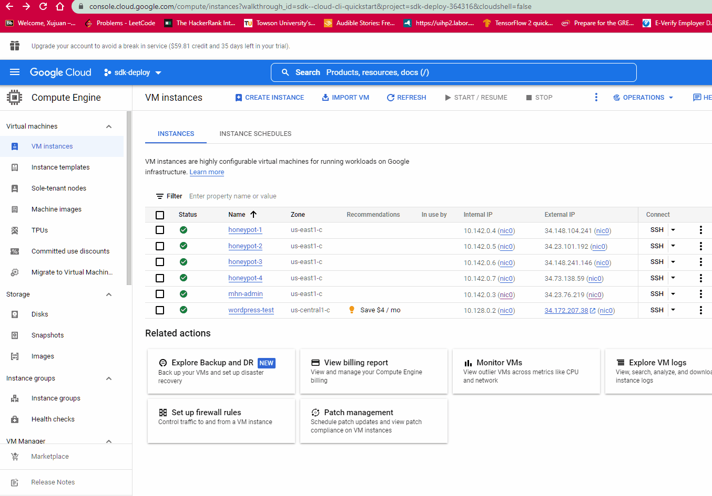
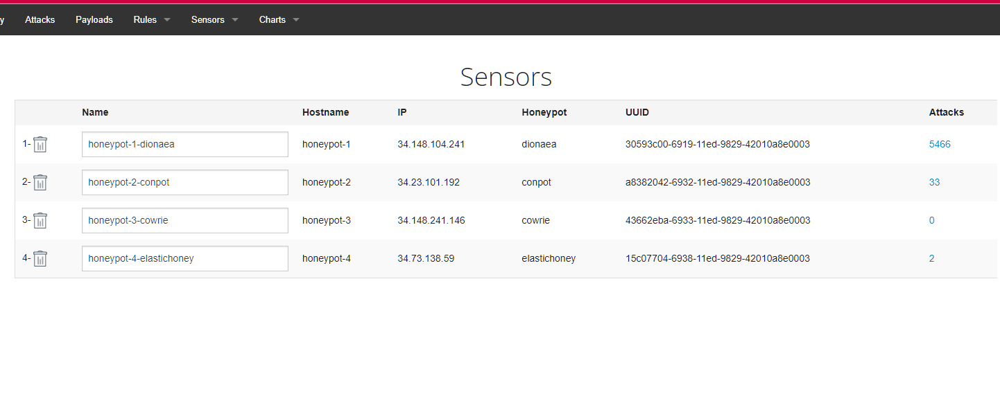
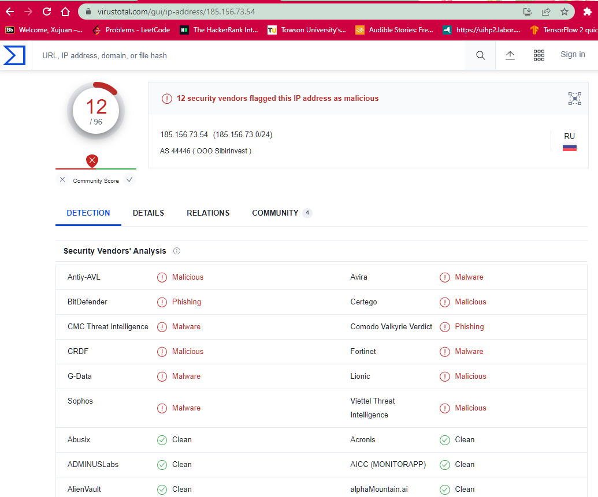
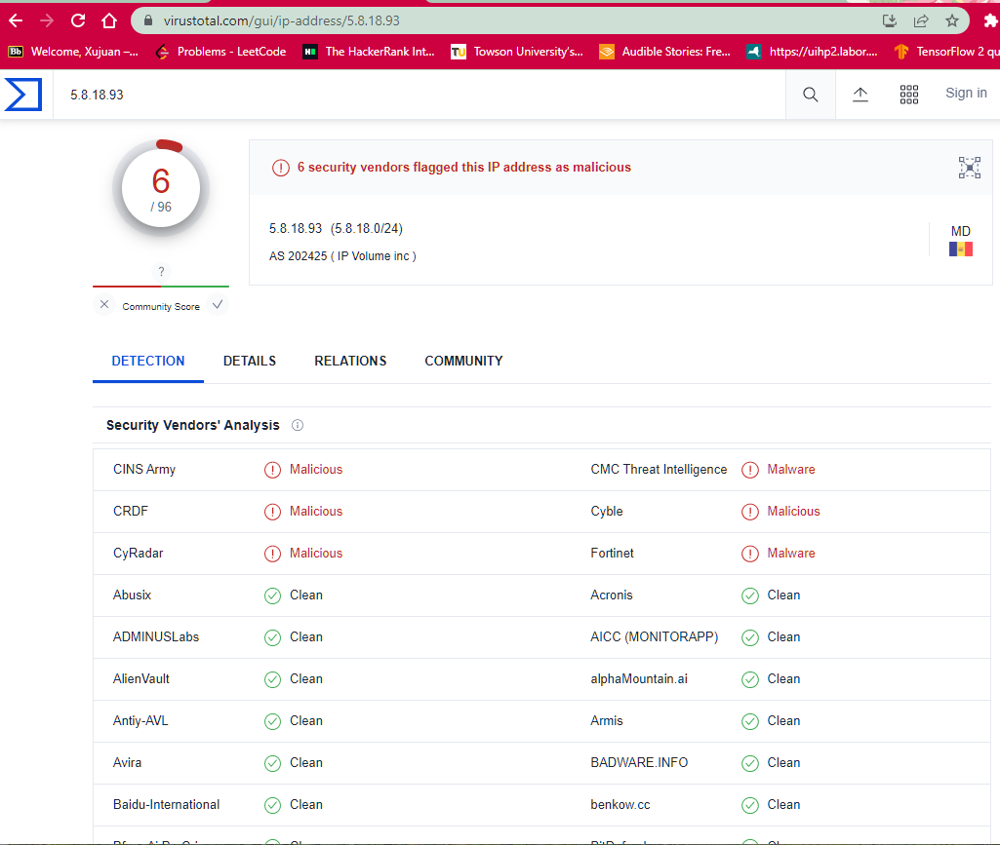

# Honeypot Assignment

**Time spent:** **10** hours spent in total

**Objective:** 
Create a honeynet using MHN-Admin. Present your findings as if you were requested to give a brief report of the current state of Internet security. Assume that your audience is a current employer who is questioning why the company should allocate anymore resources to the IT security team.

### MHN-Admin Deployment (Required)

**Summary:** 
I deployed MHN-Admin on GCP VM instance. Please see the gif below:

### Dionaea Honeypot Deployment (Required)

**Summary:** 
Dionaea is a low-interaction honeypot that captures attack payloads and malware.

### Database Backup (Required) 

**Summary:** 
MHN-Admin uses mongodb to store the data collected from honeypots.
I've exported about 4900 records in the JSON file which I have been uploaded on this GitHub branch.

The data includes: 
id, protocol, hpfeed_id, timestamp, source_ip, source_port, destination_port, identifier, and honeypot.

'''
{
  "_id": {
    "$oid": "637a9a50616a1e65e38e1ebc"
  },
  "protocol": "pcap",
  "hpfeed_id": {
    "$oid": "637a9a50616a1e65e38e1ebb"
  },
  "timestamp": {
    "$date": "2022-11-20T21:21:20.012Z"
  },
  "source_ip": "5.188.206.38",
  "source_port": 59163,
  "destination_port": 20118,
  "identifier": "30593c00-6919-11ed-9829-42010a8e0003",
  "honeypot": "dionaea"
}
'''
### Deploying Additional Honeypot(s) (Optional)

#### 4 Honeypots deployed:
- honeypot-1-dionaea
- honeypot-2-conpot
- honeypot-3-cowrie
- honeypot-4-elastichoney

### Malware Capture and Identification (Optional)

#### Malwares detected examples:

**Summary:**

file hash   80c6311c5957eeb3df80021db9b602180f20b1dca280739a3477ec3ec890ce7a

MD5	674fe254fa5aaba3975fe2b57f27c4ab

SHA-1	efca00be6076626b982c1163e19dfe55ca5cff03

## Notes

Describe any challenges encountered while doing the assignment.
