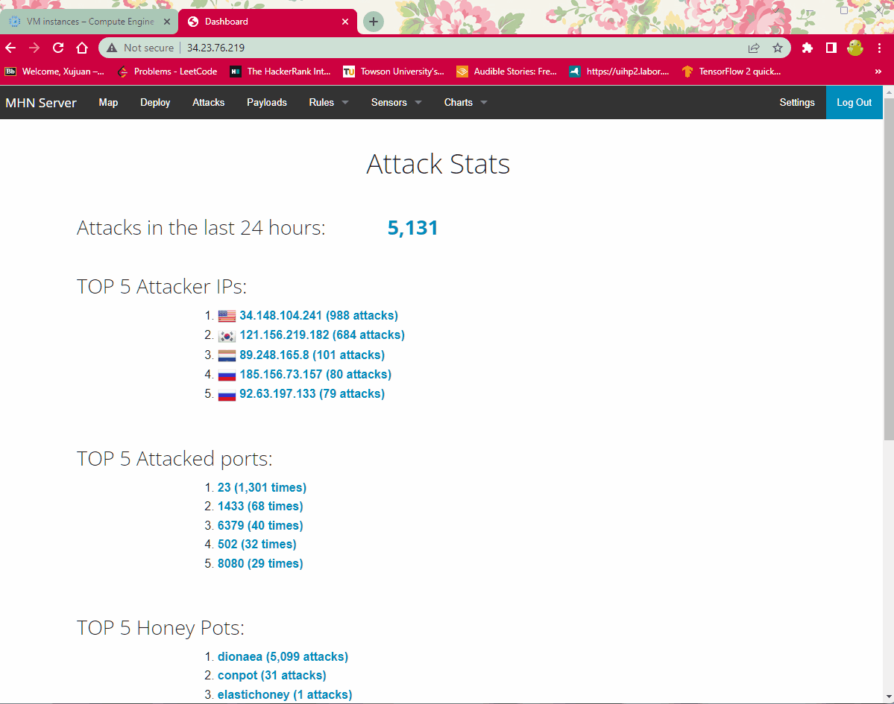

# Honeypot Assignment

**Time spent:** **10** hours spent in total

**Objective:** Create a honeynet using MHN-Admin. Present your findings as if you were requested to give a brief report of the current state of Internet security. Assume that your audience is a current employer who is questioning why the company should allocate anymore resources to the IT security team.

### MHN-Admin Deployment (Required)

**Summary:** I deployed MHN-Admin on GCP VM instance. Please see the gif below:

### Dionaea Honeypot Deployment (Required)

**Summary:** Dionaea is a low-interaction honeypot that captures attack payloads and malware.

### Database Backup (Required) 

**Summary:** MHN-Admin uses mongodb to store the data collected from honeypots.
I've exported about 4900 records in the JSON file which I have been uploaded on this GitHub branch.

### Deploying Additional Honeypot(s) (Optional)

#### 4 Honeypots deployed:
- honeypot-1-dionaea
- honeypot-2-conpot
- honeypot-3-cowrie
- honeypot-4-elastichoney

### Malware Capture and Identification (Optional)

#### X Malware

**Summary:** How did you find it? Which honeypot captured it? What does each malware do?

MD5 Hash: *Run `md5sum` on the file and record the hash here.*

SHA1 Hash: *Run `sha1sum` on the file and record the hash here.*

## Notes

Describe any challenges encountered while doing the assignment.
